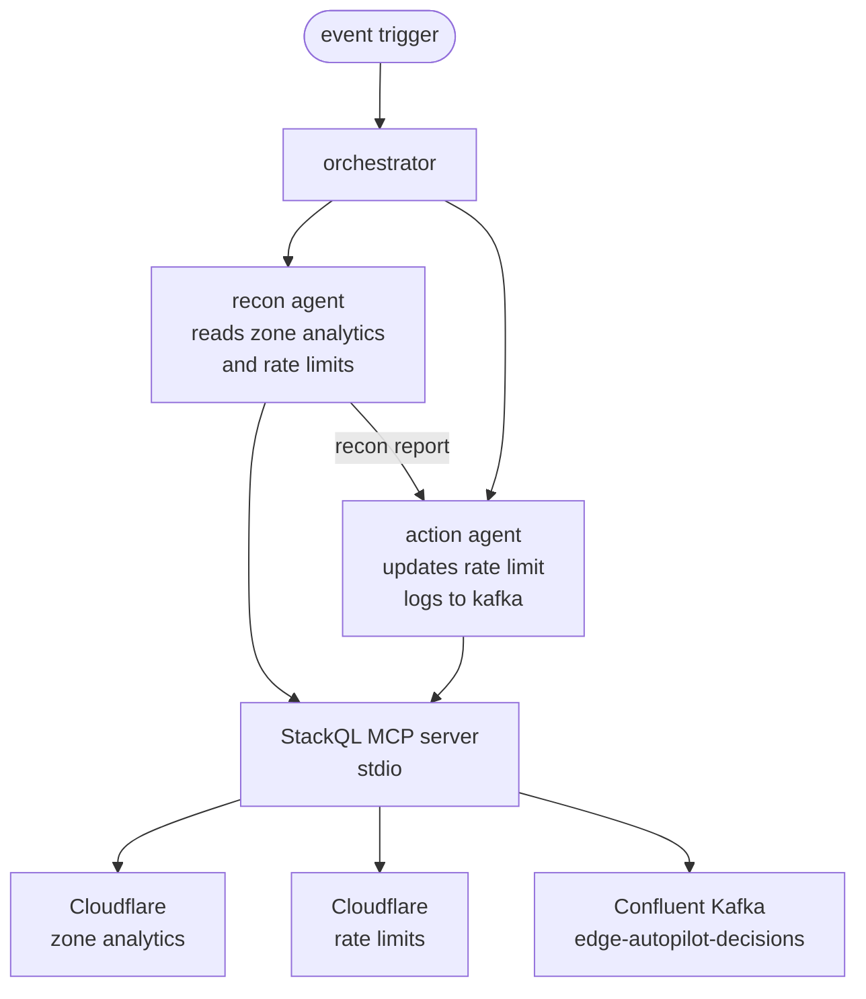

import Tabs from '@theme/Tabs';
import TabItem from '@theme/TabItem';

Edge defense is a natural fit for an agentic loop: traffic patterns shift constantly, rate-limit thresholds need to follow, and every adjustment should leave an auditable trail. The hard part is usually the plumbing - one API for analytics, another for the rate-limit control plane, another for the durable log.

**edgepilot** collapses all of that to SQL. Two Claude agents - a recon agent and an action agent - observe a live Cloudflare zone, tighten its rate-limit rule when traffic warrants, and write a decision record to a Confluent Kafka topic. Neither agent knows anything about Cloudflare's GraphQL Analytics API, Cloudflare's rulesets engine, or Confluent's Kafka REST proxy. They know SQL. The **[StackQL MCP server](https://github.com/stackql/stackql)** does the rest.

<!-- truncate -->

<div style={{position: 'relative', paddingBottom: '56.25%', height: 0, overflow: 'hidden', maxWidth: '100%', marginBottom: '1.5rem'}}>
  <iframe
    style={{position: 'absolute', top: 0, left: 0, width: '100%', height: '100%'}}
    src="https://www.youtube.com/embed/btCUiq1v29c?si=DI8HG7HvDc4zVh5R"
    title="edgepilot - two AI agents, one SQL interface, two clouds"
    frameBorder="0"
    allow="accelerometer; autoplay; clipboard-write; encrypted-media; gyroscope; picture-in-picture; web-share"
    referrerPolicy="strict-origin-when-cross-origin"
    allowFullScreen
  />
</div>

## The setup

The demo runs against a throwaway Cloudflare zone (`stackql.xyz`) and a freshly provisioned Confluent Cloud Kafka cluster. A small load generator drives synthetic traffic - some normal browsers, some AI-crawler user agents - at the zone so the analytics tables have something real to report.



Both agents speak to a single MCP server - StackQL running in stdio mode - and that server fans out to whichever provider the query targets. The agents never see API URLs, auth headers, GraphQL query strings, or Kafka REST endpoints. They see tables.

## The recon agent

The recon agent runs three SELECTs. Notice that nothing in these queries hints that one is a managed cluster API, one is a GraphQL analytics endpoint, and one is a rulesets PUT/GET pair.

### 🔍 Find the active Kafka cluster

<Tabs
  defaultValue="query"
  values={[
    { label: 'Query', value: 'query', },
    { label: 'Results', value: 'results', },
  ]
}>
<TabItem value="query">

```sql
SELECT
  id                                                                              AS kafka_cluster_id,
  JSON_EXTRACT(spec, '$.region')                                                  AS region,
  LOWER(JSON_EXTRACT(spec, '$.cloud'))                                            AS cloud_provider,
  SPLIT_PART(SPLIT_PART(JSON_EXTRACT(spec, '$.http_endpoint'), '//', 2), '.', 1)  AS kafka_endpoint_id
FROM confluent.managed_kafka_clusters.clusters
WHERE environment = 'env-xxxxx';
```

</TabItem>
<TabItem value="results">

```bash
|------------------|-----------|----------------|-------------------|
| kafka_cluster_id | region    | cloud_provider | kafka_endpoint_id |
|------------------|-----------|----------------|-------------------|
| lkc-abc123       | us-east-1 | aws            | pkc-xyz9w         |
|------------------|-----------|----------------|-------------------|
```

</TabItem>
</Tabs>

### 📊 Read live zone analytics

This one talks to Cloudflare's GraphQL Analytics API under the hood. The agent sees a table.

<Tabs
  defaultValue="query"
  values={[
    { label: 'Query', value: 'query', },
    { label: 'Results', value: 'results', },
  ]
}>
<TabItem value="query">

```sql
SELECT datetime, client_country_name, edge_response_status,
       client_request_http_method_name, requests, bytes
FROM cloudflare.zones.http_requests_adaptive_groups
WHERE zone_tag = '<zone_id>'
AND   since    = '2026-06-04T09:30:00Z'
AND   until    = '2026-06-04T10:00:00Z';
```

</TabItem>
<TabItem value="results">

```bash
|----------------------|---------------------|----------------------|---------------------------------|----------|--------|
| datetime             | client_country_name | edge_response_status | client_request_http_method_name | requests | bytes  |
|----------------------|---------------------|----------------------|---------------------------------|----------|--------|
| 2026-06-04T09:31:00Z | United States       | 200                  | GET                             | 412      | 184320 |
|----------------------|---------------------|----------------------|---------------------------------|----------|--------|
| 2026-06-04T09:31:00Z | Germany             | 200                  | GET                             | 87       | 39424  |
|----------------------|---------------------|----------------------|---------------------------------|----------|--------|
| 2026-06-04T09:32:00Z | United States       | 429                  | GET                             | 23       | 9728   |
|----------------------|---------------------|----------------------|---------------------------------|----------|--------|
| 2026-06-04T09:34:00Z | Singapore           | 200                  | POST                            | 19       | 8442   |
|----------------------|---------------------|----------------------|---------------------------------|----------|--------|
```

</TabItem>
</Tabs>

### 🛡️ Inspect the current rate-limit rule

<Tabs
  defaultValue="query"
  values={[
    { label: 'Query', value: 'query', },
    { label: 'Results', value: 'results', },
  ]
}>
<TabItem value="query">

```sql
SELECT id,
       JSON_EXTRACT(rules, '$[0].id')                            AS rule_id,
       JSON_EXTRACT(rules, '$[0].description')                   AS description,
       JSON_EXTRACT(rules, '$[0].ratelimit.requests_per_period') AS threshold,
       JSON_EXTRACT(rules, '$[0].ratelimit.period')              AS period
FROM cloudflare.rulesets.phases
WHERE zone_id       = '<zone_id>'
AND   ruleset_phase = 'http_ratelimit';
```

</TabItem>
<TabItem value="results">

```bash
|----------------------------------|----------------------------------|----------------------------------------|-----------|--------|
| id                               | rule_id                          | description                            | threshold | period |
|----------------------------------|----------------------------------|----------------------------------------|-----------|--------|
| 1a2b3c4d5e6f7890abcdef1234567890 | 9f8e7d6c5b4a3210fedcba9876543210 | edgepilot demo rule (managed by sqld)  | 100       | 10     |
|----------------------------------|----------------------------------|----------------------------------------|-----------|--------|
```

</TabItem>
</Tabs>

The recon agent hands these results to the action agent as a short plain-text report.

## The action agent

The action agent does two things: tighten the rate limit on Cloudflare, then write a decision record to Confluent Kafka. Both are mutations, expressed as standard SQL.

### ✏️ Tighten the Cloudflare rate limit

StackQL implements `REPLACE` against Cloudflare's modern rulesets PUT endpoint. The agent doesn't have to know that under the covers this is a full-document replace of every rule in the `http_ratelimit` phase entrypoint.

```sql
REPLACE cloudflare.rulesets.phases
SET rules = '[
  {
    "action": "block",
    "ratelimit": {
      "characteristics": ["ip.src", "cf.colo.id"],
      "period": 10,
      "requests_per_period": 30,
      "mitigation_timeout": 10
    },
    "expression": "len(http.request.uri.path) gt 0",
    "description": "edgepilot demo rule (managed by stackql-deploy)",
    "enabled": true
  }
]'
WHERE zone_id       = '<zone_id>'
AND   ruleset_phase = 'http_ratelimit';
```

### 📨 Log the decision to Kafka

And the action agent publishes a record to Confluent Kafka - again, as plain SQL. No producer client, no AVRO schema registry plumbing, no REST endpoint to look up. StackQL resolves the cluster's data-plane endpoint from the cluster id and posts the record.

```sql
INSERT INTO kafka.kafka.records(
  cluster_id, kafka_endpoint_id, region, cloud_provider,
  topic_name, key, value
)
SELECT
  'lkc-abc123',
  'pkc-xyz9w',
  'us-east-1',
  'aws',
  'edge-autopilot-decisions',
  '{"type":"STRING","data":"edgepilot.action"}',
  '{"type":"JSON","data":{"agent":"action","action":"tighten_rate_limit","threshold":30,"reasoning":"elevated bot traffic, dropping threshold from 100 to 30","timestamp":"2026-06-04T10:00:00Z"}}';
```

The record appears live in the **Confluent Cloud UI -> Topics -> edge-autopilot-decisions -> Messages** tab.

## Why this works as an agentic loop

Edge defense has three properties that make it well-suited to agents, and three properties that usually make it painful to wire up. SQL-over-MCP collapses the painful side:

- *The observe step (analytics), the act step (rate-limit control plane), and the audit step (durable log) normally each have their own SDK, auth model, and request shape. Here they're the same shape: a query.*
- *LLMs are reliable SQL generators - far more reliable than they are at chaining three provider-specific SDK calls correctly. Constrain the schema and the agent will stay on the rails.*
- *Adding a new signal source (WAF events, R2 logs, Workers analytics) or a new action surface (a different CDN, a different broker) is a registry pull, not a refactor of the agent loop.*

The whole loop - observe, decide, act, audit - takes about 30 to 60 seconds to run.

:::tip

The full demo, including infrastructure provisioning via [__`stackql-deploy`__](https://github.com/stackql/stackql-deploy), the load generator, and a Claude Desktop variant, is at [__`stackql/edgepilot`__](https://github.com/stackql/edgepilot).

:::

Try wiring StackQL into your own agent loop:

- *Pick any provider in the [StackQL registry](https://registry.stackql.io/) and pull it.*
- *Point an MCP-aware client (Claude Desktop, Cline, or your own SDK loop) at the StackQL MCP server.*
- *Let the model discover the schema via `SHOW METHODS` and `DESCRIBE` - no fine-tuning, no provider-specific prompting.*

⭐ us on [__GitHub__](https://github.com/stackql/stackql) and join our community!
