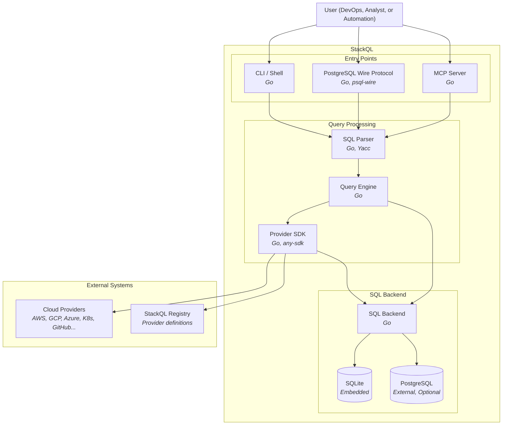

See also:
[[ Using StackQL ]](/docs/getting-started/using-stackql) [[ Using Variables ]](/docs/getting-started/variables) [[ Templating ]](/docs/getting-started/templating)

## Overview

StackQL is a unified SQL interface for querying and managing cloud infrastructure across multiple providers. The following container diagram illustrates the major components of the StackQL system and their interactions.

## Core Components

### Entry Points

StackQL supports multiple entry points for executing SQL queries:

- **CLI / Shell**: An interactive shell and command-line interface for executing SQL queries directly from the terminal. Users can run ad-hoc queries, scripts, or use the interactive shell for exploration.

- **PostgreSQL Wire Protocol**: Enables connections from standard PostgreSQL clients such as `psql`, DBeaver, or any other PostgreSQL-compatible tool. This allows seamless integration with existing database workflows and BI tools.

- **MCP Server**: A Model Context Protocol server that enables AI assistant integration, allowing large language models to query and manage infrastructure through natural language.

### Query Processing Pipeline

1. **SQL Parser**: Parses SQL input into an Abstract Syntax Tree (AST) using a custom grammar based on Yacc. The parser (implemented as `stackql-parser`) validates SQL syntax and prepares it for query planning.

2. **Query Engine**: The central orchestration layer that plans and executes queries. It determines which operations can be pushed down to the API layer versus which require local SQL processing. The query engine handles:
   - Query planning and optimization
   - Coordination between API calls and local SQL execution
   - Result aggregation and transformation

### Provider SDK (any-sdk)

The Provider SDK is a critical component that manages all interactions with cloud providers. Key responsibilities include:

- **Provider Discovery**: Fetches provider specifications from the StackQL Registry, which contains OpenAPI-based definitions for each supported cloud provider.

- **Authentication**: Handles authentication for each provider, supporting various auth methods including API keys, OAuth tokens, service account credentials, and more. Each provider definition specifies its authentication requirements.

- **API Request Building**: Transforms SQL queries into appropriate REST API calls for each provider, handling endpoint construction, parameter mapping, and request formatting.

- **Pagination**: Automatically handles paginated API responses, abstracting away the complexity of different pagination schemes used by various providers (cursor-based, offset-based, token-based, etc.).

- **Predicate Pushdown**: Where supported, pushes query predicates (WHERE clause conditions) to the provider API to minimize data transfer and improve query performance.

- **Response Transformation**: Converts API responses into relational data that can be processed by the SQL backend.

### SQL Backend

The SQL Backend executes relational operations on materialized API data:

- **SQLite**: An embedded database used for temporary table storage and relational processing. Ideal for ad-hoc queries and smaller datasets.

- **PostgreSQL**: An optional external database for persistent storage, larger datasets, and advanced analytics workloads.

The SQL backend handles operations such as:
- JOIN operations across multiple providers or resources
- Aggregate functions (COUNT, SUM, AVG, etc.)
- Sorting and filtering on materialized data
- Complex SQL expressions and subqueries

## External Systems

### Cloud Providers

StackQL connects to cloud providers (AWS, GCP, Azure, Kubernetes, GitHub, and many more) via their REST APIs. All communication is over HTTPS, and the Provider SDK handles the specifics of each provider's API conventions.

### StackQL Registry

The StackQL Registry hosts provider definitions - OpenAPI-based specifications that describe available resources, methods, and their mappings. Providers are versioned and can be pulled on-demand using the `REGISTRY PULL` command.

## Query Execution Flow

1. User submits a SQL query through one of the entry points (CLI, PostgreSQL protocol, or MCP)
2. The SQL Parser validates and converts the query into an AST
3. The Query Engine analyzes the AST and creates an execution plan
4. For provider operations, the Provider SDK:
   - Fetches the relevant provider specification from the Registry (if not cached)
   - Authenticates with the cloud provider
   - Builds and executes API requests, handling pagination automatically
   - Pushes predicates to the API where possible
   - Materializes results into the SQL backend
5. The SQL Backend executes any remaining relational operations
6. Results are returned to the user in the requested format
