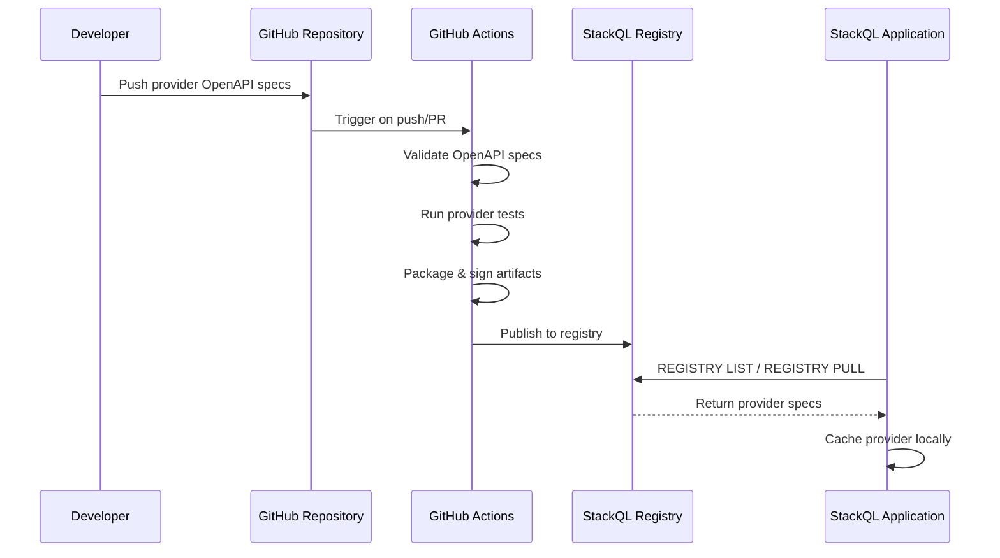

See also:
[[ StackQL Provider Registry ]](/providers) [[ Using a Provider ]](/docs/getting-started/using-a-provider)

## Overview

The StackQL Provider Registry is a crucial component of the StackQL ecosystem. It maintains and manages the 'provider' interface documents which inform the StackQL application about how to interact with various providers like AWS, Azure, Google, etc.

The registry workflow involves three key components:

1. **GitHub**: This is where the 'provider' interface documents, formatted as OpenAPI specifications in YAML, are versioned and maintained. Each provider has its document, detailing available methods and how to invoke them using SQL semantics.

2. **GitHub Actions**: Upon updates to the GitHub repository, GitHub Actions are triggered to validate, test, and package the interface documents into signed, compressed artifacts.

3. **Deno Deploy**: The packaged artifacts are then registered and published to the StackQL Provider Registry Artifact Repository via Deno Deploy. These artifacts are available to the StackQL application via the registry API, retrievable using `REGISTRY LIST` or `REGISTRY PULL` commands.

The following diagram illustrates the provider development and publishing workflow:



## StackQL Provider Basics

StackQL providers are OpenAPI-based specifications that define how StackQL interacts with cloud service APIs. Each provider encapsulates the complexity of working with a specific cloud platform, exposing resources as queryable SQL tables.

### What Providers Handle

Providers are responsible for several critical functions that abstract away API complexity:

- **Authentication**: Each provider defines its authentication requirements and methods. This includes support for API keys, OAuth 2.0 tokens, service account credentials, bearer tokens, and provider-specific authentication schemes. Users configure authentication once, and the provider handles token management and request signing.

- **Pagination**: Cloud APIs often return paginated responses for large datasets. Providers automatically handle pagination, abstracting away the differences between cursor-based, offset-based, token-based, and other pagination schemes. Users receive complete result sets without needing to manage pagination logic.

- **Predicate Pushdown**: Where supported by the underlying API, providers push query predicates (WHERE clause conditions) directly to the API. This minimizes data transfer, reduces API calls, and improves query performance by filtering data at the source rather than client-side.

- **Response Transformation**: Providers map API responses to relational table structures, handling nested objects, arrays, and complex data types to present a consistent SQL-queryable interface.

### Provider Structure

A StackQL provider typically includes:

- **Services**: Logical groupings of related resources (e.g., `compute`, `storage`, `networking`)
- **Resources**: Individual API resources exposed as SQL tables (e.g., `instances`, `buckets`, `firewalls`)
- **Methods**: Operations available on resources mapped to SQL verbs (`SELECT`, `INSERT`, `UPDATE`, `DELETE`)
- **Properties**: Resource attributes exposed as table columns

For more detailed implementation information and configuration options, see the [Provider Specification Documentation](https://github.com/stackql/any-sdk/blob/main/docs/provider_spec.md).

## Developing a Provider Locally

To develop a StackQL provider, you'll need a provider's OpenAPI or Swagger specification. These specifications could either be supplied by the provider or generated through custom scripts.

Once you have the OpenAPI specification, you can use the [__`stackql-provider-utils`__](https://github.com/stackql/stackql-provider-utils) utility project and the [__`stackql-provider-TEMPLATE`__](https://github.com/stackql/stackql-provider-TEMPLATE) template project to generate a StackQL provider document.

## Using Claude Code for Provider Development

[Claude Code](https://docs.anthropic.com/en/docs/claude-code) can assist with StackQL provider development through a specialized skill that provides comprehensive guidance on creating and configuring providers.

The [__StackQL Provider Development Skill__](https://github.com/stackql/any-sdk/blob/main/.claude/skills/stackql-provider-development.md) teaches Claude about:

- **Provider Architecture**: The hierarchical structure organizing providers into services, resources, methods, and operations
- **StackQL Extensions**: All custom `x-stackQL-*` OpenAPI extensions for resource definitions, SQL verb mappings, and query semantics
- **Authentication Configuration**: Setting up API keys, OAuth 2.0, AWS signing, service accounts, and other authentication methods
- **Pagination Strategies**: Configuring token-based, offset-based, and link header pagination
- **Query Optimization**: Implementing predicate pushdown for filtering, sorting, and projection at the API level
- **Response Transformation**: Extracting and transforming nested API responses into flat table structures

To use this skill, clone the [any-sdk](https://github.com/stackql/any-sdk) repository and work with Claude Code in that directory. Claude will automatically have access to the provider development skill and can help you create new providers, troubleshoot configuration issues, and implement advanced features like custom authentication flows or complex pagination handling.

## Testing Your Provider

To ensure that your provider works as expected, you can test it using the `dev` registry before deploying it. Here's how:

1. Export the `dev` registry URL as an environment variable:

```bash
export DEV_REG="{ \"url\": \"https://registry-dev.stackql.app/providers\" }"
./stackql --registry="${DEV_REG}" shell
```
