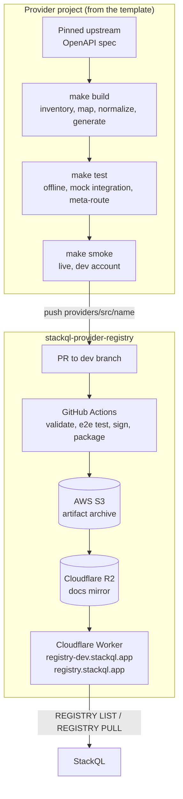

See also:
[[ StackQL Provider Registry ]](/providers) [[ Using a Provider ]](/docs/getting-started/using-a-provider) [[ REGISTRY ]](/docs/language-spec/registry) [[ Architecture ]](/docs/developers/architecture)

## Overview

A StackQL provider is a versioned set of OpenAPI documents plus `x-stackQL-*` extensions that the [any-sdk](https://github.com/stackql/any-sdk) engine turns into SQL tables: `SELECT` for reads, `INSERT`, `UPDATE`, `REPLACE` and `DELETE` for lifecycle operations, and `EXEC` for actions. Provider documents tell StackQL what a provider's API can do and how to invoke it with SQL semantics. They are plain YAML, so a provider can be built, tested and versioned like any other code.

Three repositories and one distribution layer make up the provider ecosystem:

| Component | Role |
| --- | --- |
| [__`stackql-provider-TEMPLATE`__](https://github.com/stackql-registry/stackql-provider-TEMPLATE) | The starting point for a new provider project: a deterministic `make` pipeline from a pinned upstream spec to a generated provider, credential-free test layers, a live smoke suite, a documentation microsite and CI. Bundles the Claude Code provider development skill. |
| [__`any-sdk`__](https://github.com/stackql/any-sdk) | The engine that reads provider documents and executes requests. Defines the provider document contract, the `x-stackQL-*` extensions, authentication, pagination, transforms and pushdown. |
| [__`stackql-provider-registry`__](https://github.com/stackql/stackql-provider-registry) | The source of truth for published providers. Documents are versioned under `providers/src/<provider>/<version>/`, then signed, packaged and published by GitHub Actions. |
| __Cloudflare distribution layer__ | Packaged provider artifacts are served at the edge from Cloudflare R2 by a Cloudflare Worker at `registry.stackql.app` (production) and `registry-dev.stackql.app` (development). This is what `REGISTRY LIST` and `REGISTRY PULL` talk to. |

The following diagram shows the path from a provider project to a StackQL installation:


```mermaid
flowchart TB
    subgraph Dev["Provider project (from the template)"]
        direction LR
        Spec["Pinned upstream<br/>OpenAPI spec"] --> Pipeline["make build<br/>inventory, map, normalize, generate"]
        Pipeline --> Tests["make test<br/>offline, mock integration, meta-route"]
        Tests --> Smoke["make smoke<br/>live, dev account"]
    end

    subgraph Registry["stackql-provider-registry"]
        direction LR
        PR["PR to dev branch"] --> GA["GitHub Actions<br/>validate, e2e test, sign, package"]
        GA --> S3[("AWS S3<br/>artifact archive")]
        S3 --> R2[("Cloudflare R2<br/>docs mirror")]
        R2 --> Worker["Cloudflare Worker<br/>registry-dev.stackql.app<br/>registry.stackql.app"]
    end

    Smoke -->|"push providers/src/name"| PR
    Worker -->|"REGISTRY LIST / REGISTRY PULL"| App["StackQL"]
```

## Provider Document Structure

StackQL objects follow the hierarchy `provider.service.resource.method`, for example `google.compute.instances.list`. The documents mirror that hierarchy:

```
provider.yaml                          # provider metadata, providerServices, provider-level config
services/
  <service>.yaml                       # an OpenAPI 3 document per service, plus
    components.x-stackQL-resources
      <resource>                       # id, name, methods, sqlVerbs, optional config
        methods.<method>               # operation $ref, response, request, optional config
```

- __Provider document__ (`provider.yaml`): `id`, `name`, `title`, `version`, `providerServices` (each with a `service.$ref` to its service document and an optional `preferred` flag), optional `description`, `protocolType` (`http` is the default) and `config`.
- __Service document__: a standard OpenAPI 3 document. The only required addition is `components.x-stackQL-resources`, which declares the resources exposed as tables.
- __Resource__: `id`, `name`, `methods` and `sqlVerbs`. Each resource is a table; its columns come from the response schema of its primary `select` method.
- __Method__: an `operation` that is a JSON pointer into `paths` (for example `$ref: '#/paths/~1orgs~1{org}~1repos/get'`), a `response` block (`mediaType`, `openAPIDocKey`, `objectKey`) that tells the engine where the rows are, and an optional `request` block and `config`.
- __SQL verb mapping__: `sqlVerbs.select`, `insert`, `update`, `replace` and `delete` are ordered lists of method references. References are tried in the order written and the first whose required parameters are satisfied by the `WHERE` clause wins, so list `list` before `get`. Any method not referenced by a verb list is callable via `EXEC`.

A minimal resource looks like this:

```yaml
components:
  x-stackQL-resources:
    repos:
      id: github.repos.repos
      name: repos
      title: Repos
      methods:
        list_for_org:
          operation:
            $ref: '#/paths/~1orgs~1{org}~1repos/get'
          response:
            mediaType: application/json
            openAPIDocKey: '200'
        create_in_org:
          operation:
            $ref: '#/paths/~1orgs~1{org}~1repos/post'
          response:
            mediaType: application/json
            openAPIDocKey: '201'
          config:
            requestBodyTranslate:
              algorithm: naive
      sqlVerbs:
        select:
          - $ref: '#/components/x-stackQL-resources/repos/methods/list_for_org'
        insert:
          - $ref: '#/components/x-stackQL-resources/repos/methods/create_in_org'
```

The full contract, including every key and its meaning, is in the any-sdk [Provider Specification](https://github.com/stackql/any-sdk/blob/main/docs/provider_spec.md). JSON Schemas for `provider.yaml`, service documents and the config block live in [`any-sdk/cicd/schema-definitions`](https://github.com/stackql/any-sdk/tree/main/cicd/schema-definitions); the config schema rejects unknown keys, so a mistyped key fails validation rather than being silently ignored.

### OpenAPI extensions

| Extension | Where | Purpose |
| --- | --- | --- |
| `x-stackQL-resources` | `components` | The resource dictionary for a service document (required) |
| `x-stackQL-config` | service, resource, method or operation | A config block (see below) applied at that level |
| `x-stackQL-envVar` | server variable | Names an environment variable that supplies the server variable when it is not given in the `WHERE` clause. Used to scope an API by tenant, org, project or deployment |
| `x-stackQL-alias` | parameter or schema property | An alternative name accepted in SQL for a wire-level name |
| `x-stackQL-stringOnly` | schema property | Serialize the property as a string regardless of its declared type |
| `x-stackQL-graphQL` | operation | Backs a method with a GraphQL query where the REST API lacks the data |
| `x-alwaysRequired` | parameter | Marks a parameter as always required |
| `x-protocol` | `info` | Wire-protocol hint (`query`, `ec2`, `rest-xml`) for schema-driven XML response handling |

### The config block

`config` in `provider.yaml` and `x-stackQL-config` in service documents share one schema. The allowed keys are `auth`, `pagination`, `queryParamPushdown`, `queryParamTranspose`, `requestTranslate`, `requestBodyTranslate`, `variations`, `views`, `sqlExternalTables`, `retry`, `minStackQLVersion` and `snake_case_aliases`. Config resolves from the most specific level outward, method -> resource -> service -> provider service -> provider, so a provider-wide default can be overridden for one resource or method.

## What Providers Handle

Providers are responsible for the functions that abstract away API complexity, so users get a consistent SQL interface without managing the underlying HTTP conversation.

### Authentication

Each provider ships a default `auth` block that names the environment variables holding its credentials, so a populated environment needs no runtime auth configuration. Only indirections (env var names, file paths) are accepted in a provider document; literal credential values belong exclusively in the runtime `--auth` context. Env var names should follow the vendor's Terraform provider where one exists.

| `auth.type` | Typical fields |
| --- | --- |
| `bearer` | `credentialsenvvar` |
| `api_key` | `credentialsenvvar`, `valuePrefix`, optional `location` (`header` or `query`) and `name` |
| `basic` | `username_var`, `password_var` |
| `custom` | `location`, `name`, `credentialsenvvar`, optional `valuePrefix`; chain a second credential with `successor` |
| `oauth2` | `client_id_env_var`, `client_secret_env_var`, `grant_type: client_credentials`, `token_url`, `scopes` |
| `service_account` | `credentialsenvvar` or `credentialsfilepathenvvar`, `scopes` |
| `aws_signing_v4`, `aws_assume_role` | `keyIDenvvar`, `credentialsenvvar` |
| `azure_default` | none |
| `oci_signing_v1` | `tenancy_ocid_envvar`, `user_ocid_envvar`, `oci_fingerprint_envvar`, `oci_private_key_envvar`, `oci_region_envvar` |
| `interactive` | none |
| `null_auth` | none (explicitly unauthenticated) |

For example:

```yaml
config:
  auth:
    type: api_key
    credentialsenvvar: OKTA_API_TOKEN
    valuePrefix: 'SSWS '
```

Users can override a provider's auth at runtime with `--auth='{"<provider>": {...}}'`.

### Pagination

Providers declare the vendor's pagination scheme and the engine walks every page, so users receive complete result sets. Supported schemes:

- __Token or cursor in the body__: `requestToken: {key: cursor, location: query}`, `responseToken: {key: $.cursor, location: body}`; stops when the token is absent or empty.
- __Next-page URL in the body__: `requestToken: {key: '', location: request}`, `responseToken: {key: $.next, location: body}`; `algorithm: odata_next_link` for OData `@odata.nextLink`.
- __RFC 5988 `Link` header__: `responseToken: {key: Link, location: header}`.
- __Page number with a page count__: `algorithm: page_number` with `responseToken` (current page) and `responseTerminator` (total pages).

Offset and limit APIs with no next marker are not a pagination scheme; expose `offset` and `limit` as `WHERE` parameters instead. The `--http.response.pageLimit` global flag bounds traversal.

### Predicate Pushdown

`WHERE` keys are matched against the operation's declared parameters by name (path, then query, header and cookie) and sent to the API, so filtering happens at the source. Any leftover `WHERE` key with no matching parameter is appended as a query parameter.

Beyond plain parameters, `queryParamPushdown` rewrites `SELECT` columns, `WHERE`, `ORDER BY`, `LIMIT`, `OFFSET` and `COUNT` into API parameters. `dialect: odata` fills the `$select`, `$filter`, `$orderby`, `$top`, `$skip` and `$count` defaults used by Microsoft Graph and Azure style APIs; `dialect: custom` uses `paramName` verbatim, most commonly `top: {paramName: limit, maxValue: 1000}` so `LIMIT n` becomes `?limit=n`. Predicates that cannot be pushed are still evaluated client-side.

### Response and Request Transformation

- `response.objectKey` is a JSONPath (or XPath for XML APIs) that selects the row-bearing items from an envelope, for example `$.data[*]` or `$.value`.
- `response.transform` applies a Go text template to a body before it is staged as rows; transform types cover JSON, XML and plain text, which is how AWS XML APIs and CLI output become tables.
- `requestBodyTranslate: {algorithm: naive}` lets `INSERT` take request body fields as plain column names rather than the `data__` prefixed form.
- `snake_case_aliases: true` at provider level exposes camelCase wire names as snake_case columns and parameters.
- `retry` sets an exponential backoff policy (`max_attempts`, `initial_delay_ms`, `max_delay_ms`, `multiplier`, `jitter_fraction`, `retryable_methods`, `retryable_conditions.status_codes`). The first level that declares one wins; see the any-sdk [retry policy](https://github.com/stackql/any-sdk/blob/main/docs/retry_policy.md).

Column types follow the OpenAPI schema: `string` -> text, `integer` -> integer, `number` -> numeric, `boolean` -> boolean. `object` and `array` properties are stored as JSON text, which is why nested fields are read with `json_extract` in queries and why providers often ship views (`config.views`, with per-dialect `ddl` and a `fallback`) for common nested projections.

### Non-HTTP Providers

`protocolType: local_templated` in `provider.yaml` backs a provider with local commands instead of HTTP: methods carry an `inline` array of Go-template argv fragments, parameters use `in: inline`, and a `response.transform` turns command output into rows. The [`local_openssl`](https://github.com/stackql/any-sdk/tree/main/test/registry/src/local_openssl/v0.1.0) reference provider in any-sdk shows the shape. This is out of scope for the template pipeline, which targets HTTP APIs.

## Starting a Provider Project

Start every new provider from [__`stackql-provider-TEMPLATE`__](https://github.com/stackql-registry/stackql-provider-TEMPLATE). It is a GitHub template repository that encodes the current standard for a provider: a pinned upstream spec, a deterministic build pipeline where every manual decision is a rule in a script rather than a hand edit to generated YAML, three credential-free test layers, a budgeted live smoke suite, a Docusaurus documentation site and CI. Published providers built this way live in the [stackql-registry](https://github.com/orgs/stackql-registry/repositories) GitHub organization, and are useful reference material alongside the template.

Prerequisites: Node.js 20 or later, GNU make and bash (Linux, macOS or WSL), Python 3 for the smoke suite, and a `stackql` binary (`bin/start-server.sh` downloads one if none is found).

1. Create the repository from the template (GitHub "Use this template") and run `npm install`.
2. Run `bin/init-provider.sh <name> "<Title>" [https://api.vendor.com]` to replace the placeholders across the repository.
3. Fill in the constants in `provider-dev/scripts/lib/spec_helpers.mjs` (spec URL, path version prefix, scope prefix for a tenant or project scoped API) and the config under `provider-dev/config/` (`servers.json`, `provider_config.json`, `service_names.json`).
4. Work the pipeline, either by hand through the `make` targets or by opening a Claude Code session in the repository (see below).
5. `grep -rn "TODO(template)"` lists what is still open.

The pipeline is driven by `make` (`make help` lists every target):

```bash
make fetch-spec        # verify the upstream spec against the recorded pin (fails on drift)
make inventory         # one CSV row per operation with the proposed service, resource, method and verb
make split             # write provider-dev/source/<service>.yaml from the ordered path rules
make mappings-report   # print every derived operation -> resource.method mapping without writing
make mappings          # regenerate provider-dev/config/all_services.csv and validate it
make normalize         # flatten allOf, lower oneOf/anyOf, wrap bare arrays
make generate          # generate provider.yaml + services/*.yaml, then post-process and merge GraphQL/views
make test              # offline SHOW/DESCRIBE, mock API integration tests, meta-route walk (no credentials)
make smoke             # live smoke suite against a dedicated dev account (sources .env)
make docs              # generate the provider documentation site content
make all               # everything above except the live suites
```

Under the hood the pipeline uses [__`@stackql/provider-utils`__](https://github.com/stackql-registry/stackql-provider-utils) (`split`, `normalize`, `analyze`, `generate` and `docgen`) with provider-specific rules in `provider-dev/scripts/`. The generated provider lands in `provider-dev/openapi/src/<name>/v00.00.00000/`, which is the directory that is eventually published to the registry.

`provider-dev/config/all_services.csv` is the committed contract of every operation to resource and method mapping. A diff on regeneration is a breaking change review, not noise. CI fails on uncommitted generation drift, so a regeneration must reproduce the committed artifacts byte for byte.

For an existing provider repository that predates the template, copy the `.claude/skills` directory into it and start from the skill's `references/uplift-checklist.md`.

### Using Claude Code for Provider Development

The template bundles the [__StackQL Provider Development skill__](https://github.com/stackql-registry/stackql-provider-TEMPLATE/blob/main/.claude/skills/stackql-provider-development/SKILL.md) for [Claude Code](https://docs.anthropic.com/en/docs/claude-code). Open a Claude Code session in a repository created from the template and ask it to build the provider; it picks up `CLAUDE.md` and the skill and works the steps in order. The skill is also the written procedure for doing the work by hand.

The skill covers:

- Choosing the archetype: a vendor-published OpenAPI, Swagger or discovery document (direct), or a spec derived from a vendor SDK where the SDK is the source of truth (derived)
- Fetching, fixing, validating and pinning the upstream spec so every refresh is a reviewable diff
- The endpoint inventory, the service split and the mapping rules that produce `all_services.csv`
- Every any-sdk primitive and when to use it: `x-stackQL-envVar` scoping, `objectKey`, request and response transforms, pagination, query-parameter pushdown, lifecycle `EXEC` methods, the GraphQL merge and provider views
- The three credential-free test layers and the live smoke suite
- The documentation site, CI workflows and hand-over notes

The skill's `references/` directory holds the detail for each step, and `scripts/find_extension_examples.sh` prints shipped YAML for any extension key from a clone of the provider registry, so a primitive can be seen in use before it is authored.

## Testing a Provider Locally

StackQL reads providers from a registry described by the `--registry` global flag. During development point it at the generated provider directory on the local file system with signature verification disabled (documents are only signed when they are published):

```bash
export LOCAL_REG='{ "url": "file:///path/to/provider-dev/openapi", "localDocRoot": "/path/to/provider-dev/openapi", "verifyConfig": { "nopVerify": true } }'
stackql --registry="${LOCAL_REG}" shell
```

The directory under `localDocRoot` must contain `src/<provider>/<version>/provider.yaml` and `src/<provider>/<version>/services/*.yaml`, which is exactly what the template generates. From the shell, `SHOW SERVICES IN <provider>`, `SHOW RESOURCES IN <provider>.<service>`, `SHOW METHODS IN <provider>.<service>.<resource>` and `DESCRIBE EXTENDED <provider>.<service>.<resource>` confirm the surface before any query is run. The template's `tests/offline_validation.mjs` automates these assertions, and `npm run probe -- "SELECT ..."` runs ad-hoc SQL against the mock API and prints the wire calls.

Providers pulled from a remote registry are cached under `<cwd>/.stackql` by default; use `--approot` to change the location.

The [any-sdk CLI](https://github.com/stackql/any-sdk/blob/main/docs/cli.md) is useful for checking a document without StackQL in the loop: `anysdk aot <registry> <provider.yaml>` runs static analysis over a provider (unroutable `objectKey`, missing response schemas, incomplete pagination, adjacent path parameters and so on), and `anysdk query` executes a single method directly from the provider and service documents. [Automock testing](https://github.com/stackql/any-sdk/blob/main/docs/automock_testing.md) generates a mock API and expected results from the schemas in a provider for a full round trip without touching the live API.

### Testing Your Provider using the `dev` Registry

Once a provider has been merged into the `dev` branch of the registry, it is available from the development registry. Point StackQL at it to verify the published artifact:

```bash
export DEV_REG='{ "url": "https://registry-dev.stackql.app/providers" }'
stackql --registry="${DEV_REG}" shell
```

```sql
REGISTRY PULL myprovider;
```

The template's `make smoke-live` target runs the smoke suite against the published provider for post-publish verification.

## Publishing a Provider

Publishing is a separate, human-in-the-loop step and is not part of the template pipeline.

1. Fork [stackql-provider-registry](https://github.com/stackql/stackql-provider-registry) and copy the generated `provider-dev/openapi/src/<name>` directory to `providers/src/<name>` in a feature branch.
2. Raise a pull request against the `dev` branch with a description of the provider and the changes (see the registry [contribution guide](https://github.com/stackql/stackql-provider-registry/blob/main/.github/CONTRIBUTING.md)).
3. GitHub Actions validates and tests the provider using [stackql-provider-tests](https://github.com/stackql/stackql-provider-tests). The rules evaluated are: the document must be a valid OpenAPI specification, all services must be enumerable for resources, all resources must be enumerable for methods, methods callable via `SELECT` must have a valid response schema, and methods callable via `INSERT` must have a valid request schema.
4. On merge, the workflow allocates a version, signs the documents (Ed25519), packages them and publishes the artifact to the AWS S3 archive. The docs tree is then mirrored to Cloudflare R2 and the Cloudflare Worker serving `registry-dev.stackql.app` is deployed. The provider is immediately available to installations configured to use the `dev` registry.
5. After a period of monitoring, `dev` is promoted to `main`, which repeats the publish for `registry.stackql.app`. This is publication for default configured instances of StackQL.

The same `stackql-provider-tests` harness can be run locally against a registry directory before raising a PR:

```bash
test-provider.sh <provider_name> false /path/to/provider-dev/openapi
```

See [build and deployment](https://github.com/stackql/stackql-provider-registry/blob/main/docs/build-and-deployment.md) in the registry repository for the workflow in detail, including the provider delete guard that protects `providers/src`.
