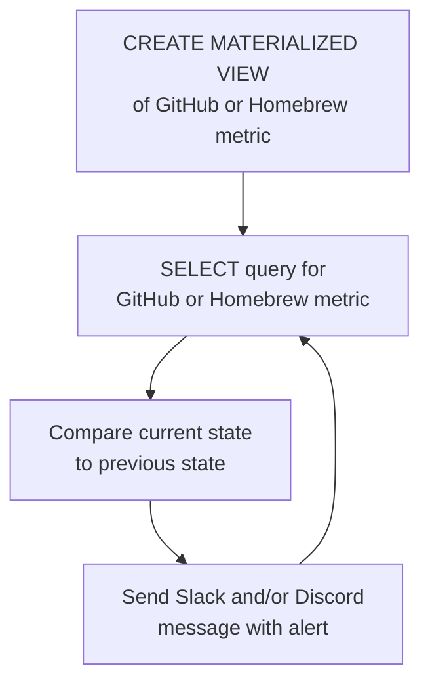

# Open Source Project Activity Monitor powered by StackQL

In this guide, we will demonstrate how to self host a real-time monitoring and alerting system for GitHub open source software maintainers.  

> [__stackql__](https://github.com/stackql/stackql) is an open source tool allowing users to query and interact with cloud and SaaS resources using a SQL language and data visualization and analysis libraries and tools. [⭐](https://github.com/stackql/stackql) us if you like this!

Get alerts like this in Slack and Discord in realtime:


Tested with <span class="tutorial_tested_on">embedded sql backend</span> <span class="tutorial_tested_on">docker</span> <span class="tutorial_tested_on">linux</span> 

## Overview

When I looked for tools to monitor our open source project, I found most of them didn't work as advertised or didn't work at all (in the case of thrid part apps in GitHub), so I built our own which you could launch and use on your open source GitHub project...  

The [__oss-activity-monitor__](https://github.com/stackql/oss-activity-monitor) project uses [__stackql__](https://github.com/stackql/stackql) to perform real-time open source project activity monitoring, this includes real time notification of:

- ⭐ new GitHub repo stargazers
- 👀 new GitHub repo watchers
- 🍴 new GitHub repo forks
- 📊 new GitHub repo issues
- 🙋 new GitHub org followers
- 📦 new GitHub release asset downloads
- 🍺 new homebrew downloads

## How it works

The project is deployed in a container (using `docker` or other container deployment platform), it is built using `python` and the [`pystackql`](https://pystackql.readthedocs.io/en/latest/intro.html) package, using the [`github`](https://github.stackql.io/providers/github/) and [`homebrew`](https://homebrew.stackql.io/providers/homebrew) providers for `stackql`.  Materialized views and `SELECT` statements are used to capture and compare state between current and previous metrics for GitHub and Homebrew monitored endpoints, this is described in the diagram here:  


for example, here given this materialized view created and populated using `stackql`:  

```sql
CREATE OR REPLACE MATERIALIZED VIEW mvw_github_repo_stargazers AS 
SELECT login FROM github.activity.repo_stargazers
WHERE owner = 'your-org' and repo = 'your-repo'
```

the following `stackql` query polls GitHub for new stargazers...

```sql
SELECT c.login
FROM github.activity.repo_stargazers c
LEFT JOIN mvw_github_repo_stargazers mvw
ON c.login = mvw.login
WHERE mvw.login IS NULL
AND c.owner = 'your-org' AND c.repo = 'your-repo'
```

then the state is refreshed using...

```sql
REFRESH MATERIALIZED VIEW mvw_github_repo_stargazers
```

similar patterns are repeated for repo watchers, issues, org followers, release asset downloads and homebrew downloads.

## Running the project

Follow the steps below to get the project up and running locally or on your preferred cloud platform.  

### 1. Clone the repo

```bash
git clone https://github.com/stackql/oss-activity-monitor.git
# or 
git clone git@github.com:stackql/oss-activity-monitor.git
```

### 2. Configure environment variables

The following environment variables are required to configure the project (provided using environment variables, a `.env` file in the example below):  

| Variable                   | Description                                                                       | Example Value                                    |
|----------------------------|-----------------------------------------------------------------------------------|--------------------------------------------------|
| `LOG_LEVEL`                | Log level (INFO for general logs; DEBUG for detailed logging)                     | INFO                                             |
| `SLEEP_INTERVAL`           | Time delay in seconds between request loops                                       | 5                                                |
| `GITHUB_REPO`              | GitHub repository name                                                            | stackql                                          |
| `GITHUB_REPO_OWNER`        | GitHub organization or owner name                                                 | stackql                                          |
| `HOMEBREW_FORMULA_NAME`    | Homebrew formula name, if available                                               | stackql                                          |
| `STACKQL_GITHUB_USERNAME`  | Your GitHub username                                                              | jeffreyaven                                      |
| `STACKQL_GITHUB_PASSWORD`  | Your GitHub personal access token                                                 | ghp_yourpersonalaccesstoken                      |
| `SLACK_WEBHOOK_URL`        | Slack webhook URL for sending notifications                                       | https://hooks.slack.com/services/...             |
| `DISCORD_WEBHOOK_URL`      | Discord webhook URL for sending notifications                                     | https://discord.com/api/webhooks/...             |

### 3. Build the container

```bash
docker build --no-cache -t oss-activity-monitor .
```

### 4. Run the container

```bash
docker run --env-file .env oss-activity-monitor
```

thats it!  You'll now get real-time alerts when there is activity on your open source project.  To stop the container, use:  

```bash
docker stop $(docker ps -a -q --filter ancestor=oss-activity-monitor)
```

⭐ us on [__GitHub__](https://github.com/stackql/stackql)